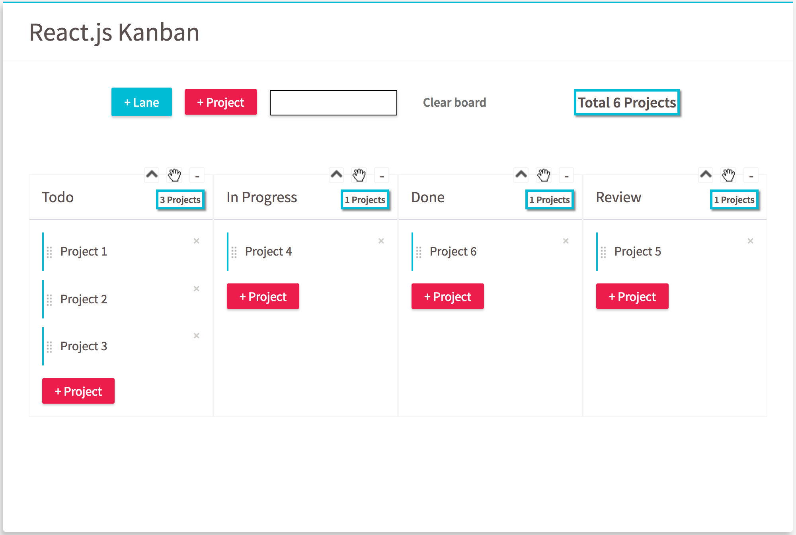

# Kanban Board built with React.js & Redux

## Steps to compile/run the app

Firstly, build the application

	$ npm run build
	
Secondly, start the application
	
	$ npm run start
	
To run the test cases

	$ npm run test

## Required Features

1. Entering text in the 'add project' input and hitting enter will add it as an item to the 'todo' list.
2. Three columns for 'Todo', 'In Progress', and 'Done' projects.
3. Projects should be draggable and sortable within the same column.
	(note: Currently the projects are sorted according to the timestamp when it is created.)
4. Projects can also be dragged between adjacent columns.
5. The total at the top of each column reflects the number of projects.
6. The global total reflects the the global sum of projects.

## Additional Features

1. Add new Lane.
2. Add new project in each lane.
3. Change project or lane text in the lane.
4. Close / drag and drop lanes and re-arrange the order of all the lanes.
5. Reset persisted store to clear the kanban board.
6. Add travis CI into the project to build and test the app.
